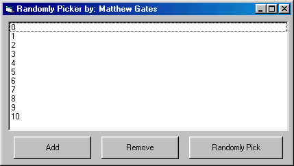

## Randomly Pick from a List

### Description

Randomly pick any word or number from a listbox.
 
### More Info
 

             |
---                |---
**Submitted On**   |2000-07-03 15:57:06
**By**             |[Matthew Gates](https://github.com/Planet-Source-Code/PSCIndex/blob/master/ByAuthor/matthew-gates.md)
**Level**          |Beginner
**User Rating**    |4.0 (12 globes from 3 users)
**Compatibility**  |VB 3\.0, VB 4\.0 \(16\-bit\), VB 4\.0 \(32\-bit\), VB 5\.0, VB 6\.0, VB Script, ASP \(Active Server Pages\) 
**Category**       |[Miscellaneous](https://github.com/Planet-Source-Code/PSCIndex/blob/master/ByCategory/miscellaneous__1-1.md)
**World**          |[Visual Basic](https://github.com/Planet-Source-Code/PSCIndex/blob/master/ByWorld/visual-basic.md)
**Archive File**   |[CODE\_UPLOAD7410732000\.zip](https://github.com/Planet-Source-Code/matthew-gates-randomly-pick-from-a-list__1-9481/archive/master.zip)

